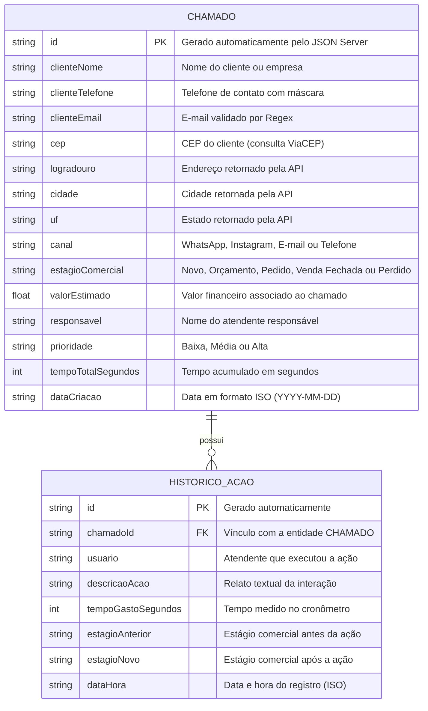

# 🛠️ Especificação Técnica (Tech Spec) - CRM Atendimento

Este documento detalha a arquitetura técnica, o modelo de dados e os contratos de API (via JSON Server e APIs externas) necessários para o funcionamento do **CRM de Atendimento & Vendas**.

---

## 1. Modelo de Dados (Diagrama ER)



---

## 2. Dicionário de Dados

* **Chamados (`/chamados`):** Registra os dados mestres da oportunidade comercial e o estado consolidado do lead.
* `id`: Identificador único da oportunidade.
* `clienteNome`, `clienteTelefone`, `clienteEmail`: Dados de contato primários do cliente.
* `cep`, `logradouro`, `cidade`, `uf`: Dados de localização populados via requisição assíncrona da API pública ViaCEP.
* `canal`: Canal de entrada do cliente (WhatsApp, Instagram, E-mail, Telefone).
* `estagioComercial`: Posição atual do cliente no funil de vendas.
* `valorEstimado`: Valor financeiro projetado ou fechado na negociação.
* `responsavel`: Colaborador atualmente encarregado do lead.
* `tempoTotalSegundos`: Soma acumulada do tempo gasto em todas as ações executadas para este chamado.


* **Histórico de Ações (`/historico_acoes`):** Registra cada interação cronometrada individualmente.
* `chamadoId`: Chave estrangeira que conecta o registro ao chamado mestre.
* `usuario`: Atendente ativo na sessão (recuperado do `localStorage`) no momento do registro.
* `descricaoAcao`: Relato detalhado sobre a conversa ou procedimento realizado.
* `tempoGastoSegundos`: Duração da sessão de atendimento capturada pelo cronômetro.


---

## 3. Rotas da API e Integrações

### API Fake (JSON Server - Servidor Local)

* `GET /chamados` — Retorna a lista completa de chamados para exibição no Dashboard.
* `GET /chamados/:id` — Retorna os detalhes de um chamado específico para a tela de atendimento.
* `POST /chamados` — Cadastra um novo chamado a partir do formulário de cadastro.
* `PATCH /chamados/:id` — Atualiza o estágio comercial, valor financeiro e tempo total acumulado de um chamado.
* `DELETE /chamados/:id` — Exclui um chamado do sistema via Modal de confirmação.
* `GET /historico_acoes?chamadoId=:id` — Filtra todas as ações e interações vinculadas a um determinado chamado.
* `POST /historico_acoes` — Registra uma nova ação cronometrada finalizada.

### API Pública Externa

* `GET [https://viacep.com.br/ws/](https://viacep.com.br/ws/){cep}/json/` — Consulta os dados de endereço (logradouro, bairro, localidade, uf) para preenchimento automático do formulário com tratamento de erros (CEP inexistente ou formato inválido).

---

## 4. Estrutura do Banco de Dados (`db.json`)

```json
{
  "chamados": [
    {
      "id": "1",
      "clienteNome": "Ana Maria Silva",
      "clienteTelefone": "(41) 99887-6655",
      "clienteEmail": "ana.silva@email.com",
      "cep": "80010-000",
      "logradouro": "Praça Tiradentes",
      "cidade": "Curitiba",
      "uf": "PR",
      "canal": "WhatsApp",
      "estagioComercial": "Orçamento",
      "valorEstimado": 1500.00,
      "responsavel": "Carlos Souza",
      "prioridade": "Alta",
      "tempoTotalSegundos": 750,
      "dataCriacao": "2026-08-20"
    },
    {
      "id": "2",
      "clienteNome": "Tech Solutions Ltda",
      "clienteTelefone": "(11) 91234-5678",
      "clienteEmail": "contato@techsolutions.com",
      "cep": "01001-000",
      "logradouro": "Praça da Sé",
      "cidade": "São Paulo",
      "uf": "SP",
      "canal": "Instagram",
      "estagioComercial": "Novo",
      "valorEstimado": 4800.00,
      "responsavel": "Beatriz Lima",
      "prioridade": "Média",
      "tempoTotalSegundos": 0,
      "dataCriacao": "2026-08-25"
    }
  ],
  "historico_acoes": [
    {
      "id": "101",
      "chamadoId": "1",
      "usuario": "Carlos Souza",
      "descricaoAcao": "Primeiro contato via WhatsApp para entender os requisitos do software.",
      "tempoGastoSegundos": 450,
      "estagioAnterior": "Novo",
      "estagioNovo": "Orçamento",
      "dataHora": "2026-08-20T14:30:00.000Z"
    },
    {
      "id": "102",
      "chamadoId": "1",
      "usuario": "Carlos Souza",
      "descricaoAcao": "Apresentação da proposta comercial e alinhamento de prazos.",
      "tempoGastoSegundos": 300,
      "estagioAnterior": "Orçamento",
      "estagioNovo": "Orçamento",
      "dataHora": "2026-08-21T10:15:00.000Z"
    }
  ]
}

```